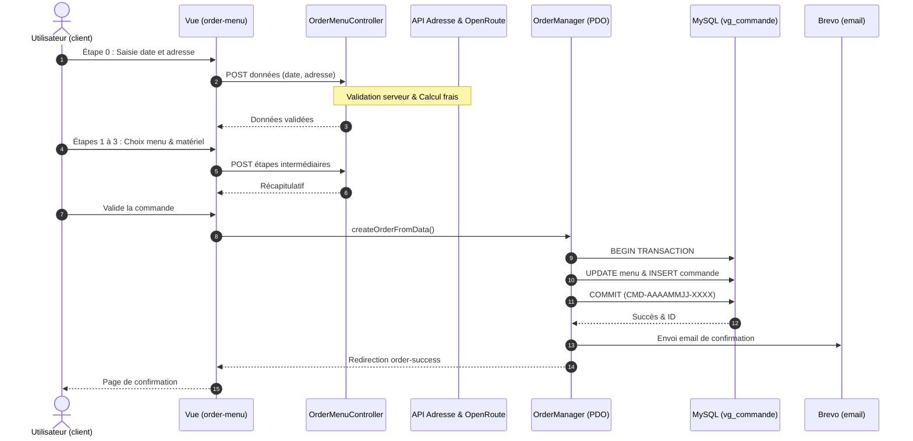

<!-- Diagramme de Séquence -->



<!-- Use cases -->

```mermaid
flowchart LR
Utilisateur(("Utilisateur / Client")) --> UC1["Consulter le catalogue & menus"] & UC2["Gérer son compte & connexion"] & UC3["Passer et payer une commande"] & UC4["Annuler une commande"]
Employé(("Employé / Staff")) --> UC5["Gérer le catalogue & les stocks"] & UC6["Traiter et valider les commandes"]
Administrateur(("Administrateur")) --> UC5 & UC6 & UC7["Administrer les utilisateurs & rôles"]
UC3 -. précondition : utilisateur connecté .-> UC2
UC3 --> Auth@{ label: "Vérifier l'authentification" }
Auth -- Connecté --> Commande["Continuer vers la commande"]
Auth -- Non connecté / non inscrit --> AuthPage["Page Login / Sign-in"]
AuthPage -- Authentification réussie --> Commande
AuthPage -- Retour vers le menu --> UC1
UC3 -. utilise .-> EXT1(("OpenRoute / API Adresse")) & EXT2(("Brevo / Courriels"))
UC2 -. utilise .-> EXT2
UC4 -. utilise .-> EXT2
UC6 -. utilise .-> EXT2
...
    Auth@{ shape: rect}
     Utilisateur:::actor
...
     UC1:::usecase
     UC2:::usecase
     UC3:::usecase
     UC4:::usecase
     Employé:::actor
     UC5:::usecase
     UC6:::usecase
     Administrateur:::actor
     UC7:::usecase
     Auth:::auth
     Commande:::usecase
     AuthPage:::auth
     EXT1:::external
     EXT2:::external
    classDef actor fill:#eef2ff,stroke:#818cf8,stroke-width:2px
    classDef usecase fill:#f0fdfa,stroke:#2dd4bf,stroke-width:1.5px
    classDef auth fill:#fff7ed,stroke:#fb923c,stroke-width:2px
    classDef external fill:#f5f3ff,stroke:#a78bfa,stroke-width:1.5px
...


<!-- Uml merise -->

```plantuml

@startuml
skinparam linetype ortho
skinparam DefaultTextAlignment left
skinparam PackageStyle rectangle

entity "vg_role" as vg_role {
    * role_id : int <<PK>>
    --
    libelle : varchar
}

entity "vg_utilisateur" as vg_utilisateur {
    * utilisateur_id : int <<PK>>
    --
    email : varchar
    password : varchar
    prenom : varchar
    nom : varchar
    telephone : varchar
    ville : varchar
    pays : varchar
    adresse_postale : varchar
    * role_id : int <<FK>>
    est_actif : tinyint
    created_at : timestamp
}

entity "vg_theme" as vg_theme {
    * theme_id : int <<PK>>
    --
    libelle : varchar
}

entity "vg_regime" as vg_regime {
    * regime_id : int <<PK>>
    --
    libelle : varchar
}

entity "vg_menu" as vg_menu {
    * menu_id : int <<PK>>
    --
    titre : varchar
    nombre_personne_minimum : int
    prix_par_personne : double
    description_menu : varchar
    quantite_restante : int
    * theme_id : int <<FK>>
    * regime_id : int <<FK>>
    delai_commande : int
    conditions_stockage : text
    is_active : tinyint
}

entity "vg_plat" as vg_plat {
    * plat_id : int <<PK>>
    --
    titre_plat : varchar
    description_plat : varchar
    photo : varchar
    categorie : varchar
    is_active : tinyint
}

entity "vg_allergene" as vg_allergene {
    * allergene_id : int <<PK>>
    --
    libelle : varchar
}

entity "vg_lieu_prestation" as vg_lieu_prestation {
    * id : int <<PK>>
    --
    adresse : varchar
    ville : varchar
    code_postal : varchar
    latitude : decimal
    longitude : decimal
    distance_bordeaux : decimal
}

entity "vg_horaire" as vg_horaire {
    * horaire_id : int <<PK>>
    --
    jour : varchar
    heure_ouverture : varchar
    heure_fermeture : varchar
}

entity "vg_commande" as vg_commande {
    * commande_id : int <<PK>>
    --
    numero_commande : varchar
    date_commande : date
    date_prestation : date
    heure_livraison : varchar
    prix_menu : double
    nombre_personne : int
    prix_livraison : double
    statut : enum
    pret_materiel : tinyint
    restitution_materiel : tinyint
    * utilisateur_id : int <<FK>>
    * menu_id : int <<FK>>
    * lieu_prestation_id : int <<FK>>
    motif_annulation : text
    mode_contact : varchar
    prix_total : decimal
    depot_garantie : decimal
}

entity "vg_commande_statut_historique" as vg_commande_statut_historique {
    * historique_id : int <<PK>>
    --
    * commande_id : int <<FK>>
    statut : varchar
    date_changement : datetime
}

entity "vg_avis" as vg_avis {
    * avis_id : int <<PK>>
    --
    note : int
    description : varchar
    statut : varchar
    * utilisateur_id : int <<FK>>
    * commande_id : int <<FK>>
    created_at : timestamp
    validated_by : int
    validated_by_name : varchar
    validated_at : datetime
}

entity "vg_password_resets" as vg_password_resets {
    * id : int <<PK>>
    --
    email : varchar
    token : varchar
    created_at : timestamp
    expires_at : datetime
}

entity "vg_menu_plat" as vg_menu_plat {
    * menu_id : int <<PK, FK>>
    * plat_id : int <<PK, FK>>
}

entity "vg_allergene_plat" as vg_allergene_plat {
    * plat_id : int <<PK, FK>>
    * allergene_id : int <<PK, FK>>
}

' Relations
vg_role ||--o{ vg_utilisateur : "attribue"
vg_utilisateur ||--o{ vg_commande : "passe"
vg_utilisateur ||--o{ vg_avis : "laisse"
vg_commande ||--o| vg_avis : "concerne"
vg_theme ||--o{ vg_menu : "classifie"
vg_regime ||--o{ vg_menu : "qualifie"
vg_menu ||--o{ vg_commande : "concerne"
vg_lieu_prestation ||--o{ vg_commande : "accueille"
vg_commande ||--o{ vg_commande_statut_historique : "trace"
vg_menu ||--|{ vg_menu_plat : "contient"
vg_plat ||--|{ vg_menu_plat : "compose"
vg_plat ||--|{ vg_allergene_plat : "contient"
vg_allergene ||--|{ vg_allergene_plat : "affecte"
@enduml

```` ``` ````