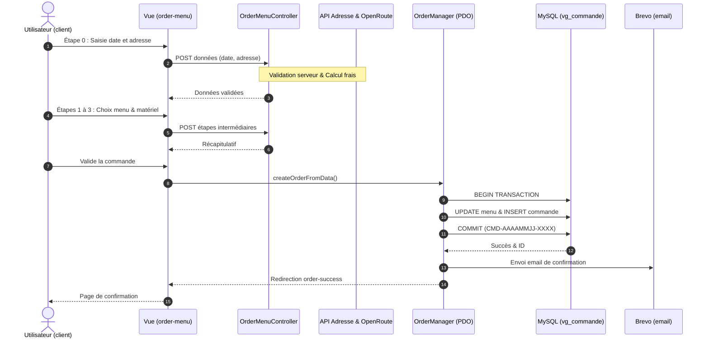
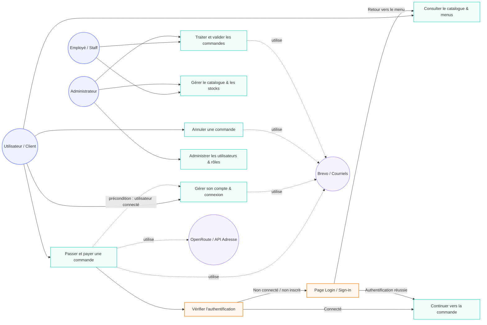
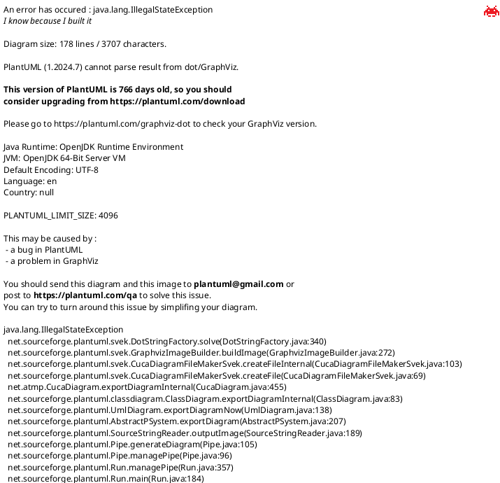

<!-- Diagramme de Séquence -->

```mermaid
sequenceDiagram
autonumber
actor Client as Utilisateur (client)
participant Vue as Vue (order-menu)
participant Ctrl as OrderMenuController
participant API as API Adresse & OpenRoute
participant Manager as OrderManager (PDO)
participant DB as MySQL (vg_commande)
participant Email as Brevo (email)

    Client->>Vue: Étape 0 : Saisie date et adresse
    Vue->>Ctrl: POST données (date, adresse)
    Note over Ctrl,API: Validation serveur & Calcul frais
    Ctrl-->>Vue: Données validées

    Client->>Vue: Étapes 1 à 3 : Choix menu & matériel
    Vue->>Ctrl: POST étapes intermédiaires
    Ctrl-->>Vue: Récapitulatif

    Client->>Vue: Valide la commande
    Vue->>Manager: createOrderFromData()

    Manager->>DB: BEGIN TRANSACTION
    Manager->>DB: UPDATE menu & INSERT commande
    Manager->>DB: COMMIT (CMD-AAAAMMJJ-XXXX)

    DB-->>Manager: Succès & ID
    Manager->>Email: Envoi email de confirmation
    Manager-->>Vue: Redirection order-success
    Vue-->>Client: Page de confirmation
```

<!-- Use cases -->

```mermaid
flowchart LR
Utilisateur(("Utilisateur / Client")) --> UC1["Consulter le catalogue & menus"] & UC2["Gérer son compte & connexion"] & UC3["Passer et payer une commande"] & UC4["Annuler une commande"]
Employé(("Employé / Staff")) --> UC5["Gérer le catalogue & les stocks"] & UC6["Traiter et valider les commandes"]
Administrateur(("Administrateur")) --> UC5 & UC6 & UC7["Administrer les utilisateurs & rôles"]
UC3 -. précondition : utilisateur connecté .-> UC2
UC3 --> Auth@{ label: "Vérifier l'authentification" }
Auth -- Connecté --> Commande["Continuer vers la commande"]
Auth -- Non connecté / non inscrit --> AuthPage["Page Login / Sign-in"]
AuthPage -- Authentification réussie --> Commande
AuthPage -- Retour vers le menu --> UC1
UC3 -. utilise .-> EXT1(("OpenRoute / API Adresse")) & EXT2(("Brevo / Courriels"))
UC2 -. utilise .-> EXT2
UC4 -. utilise .-> EXT2
UC6 -. utilise .-> EXT2
    Auth@{ shape: rect}
     Utilisateur:::actor
     UC1:::usecase
     UC2:::usecase
     UC3:::usecase
     UC4:::usecase
     Employé:::actor
     UC5:::usecase
     UC6:::usecase
     Administrateur:::actor
     UC7:::usecase
     Auth:::auth
     Commande:::usecase
     AuthPage:::auth
     EXT1:::external
     EXT2:::external
    classDef actor fill:#eef2ff,stroke:#818cf8,stroke-width:2px
    classDef usecase fill:#f0fdfa,stroke:#2dd4bf,stroke-width:1.5px
    classDef auth fill:#fff7ed,stroke:#fb923c,stroke-width:2px
    classDef external fill:#f5f3ff,stroke:#a78bfa,stroke-width:1.5px
```

<!-- Uml merise -->

```plantuml

@startuml
left to right direction

' ============================================================
' MCD - Vite & Gourmand (notation Merise, cardinalites textuelles)
' ============================================================

skinparam linetype ortho
skinparam nodesep 100
skinparam ranksep 100
hide circle
hide empty members

entity "vg_utilisateur" as utilisateur {
  * utilisateur_id : int <<PK>>
  --
  email : varchar(50)
  password : varchar(255)
  prenom : varchar(50)
  nom : varchar(50)
  telephone : varchar(50)
  ville : varchar(50)
  pays : varchar(50)
  adresse_postale : varchar(50)
  role_id : int <<FK>>
  est_actif : tinyint(1)
  created_at : timestamp
}

entity "vg_role" as role {
  * role_id : int <<PK>>
  --
  libelle : varchar(50)
}

entity "vg_menu" as menu {
  * menu_id : int <<PK>>
  --
  titre : varchar(50)
  nombre_personne_minimum : int
  prix_par_personne : double
  description_menu : varchar(50)
  quantite_restante : int
  theme_id : int <<FK>>
  regime_id : int <<FK>>
  delai_commande : int
  conditions_stockage : text
  is_active : tinyint(1)
}

entity "vg_plat" as plat {
  * plat_id : int <<PK>>
  --
  titre_plat : varchar(50)
  description_plat : varchar(255)
  photo : varchar(255)
  categorie : varchar(50)
  is_active : tinyint(1)
}

entity "vg_menu_plat" as menu_plat {
  * menu_id : int <<PK,FK>>
  * plat_id : int <<PK,FK>>
}

entity "vg_theme" as theme {
  * theme_id : int <<PK>>
  --
  libelle : varchar(50)
}

entity "vg_regime" as regime {
  * regime_id : int <<PK>>
  --
  libelle : varchar(50)
}

entity "vg_allergene" as allergene {
  * allergene_id : int <<PK>>
  --
  libelle : varchar(50)
}

entity "vg_allergene_plat" as allergene_plat {
  * plat_id : int <<PK,FK>>
  * allergene_id : int <<PK,FK>>
}

entity "vg_commande" as commande {
  * commande_id : int <<PK>>
  --
  numero_commande : varchar(50)
  date_commande : date
  date_prestation : date
  heure_livraison : varchar(50)
  prix_menu : double
  nombre_personne : int
  prix_livraison : double
  statut : enum
  pret_materiel : tinyint(1)
  restitution_materiel : tinyint(1)
  utilisateur_id : int <<FK>>
  menu_id : int <<FK>>
  lieu_prestation_id : int <<FK>>
  motif_annulation : text
  mode_contact : varchar(50)
  prix_total : decimal(10,2)
  depot_garantie : decimal(10,2)
}

entity "vg_commande_statut_historique" as historique {
  * historique_id : int <<PK>>
  --
  commande_id : int <<FK>>
  statut : varchar(50)
  date_changement : datetime
}

entity "vg_lieu_prestation" as lieu {
  * id : int <<PK>>
  --
  adresse : varchar(255)
  ville : varchar(100)
  code_postal : varchar(10)
  latitude : decimal(10,8)
  longitude : decimal(11,8)
  distance_bordeaux : decimal(5,2)
}

entity "vg_avis" as avis {
  * avis_id : int <<PK>>
  --
  note : int
  description : varchar(255)
  statut : varchar(20)
  utilisateur_id : int <<FK>>
  commande_id : int <<FK>>
  created_at : timestamp
  validated_by : int
  validated_by_name : varchar(100)
  validated_at : datetime
}

entity "vg_horaire" as horaire {
  * horaire_id : int <<PK>>
  --
  jour : varchar(50)
  heure_ouverture : varchar(50)
  heure_fermeture : varchar(50)
}

entity "vg_password_resets" as resets {
  * id : int <<PK>>
  --
  email : varchar(50) <<unique>>
  token : varchar(255)
  created_at : timestamp
  expires_at : datetime
}

' ============================================================
' RELATIONS - Cardinalites textuelles explicites (notation Merise)
' Format : EntiteA "cardinalite_A" -- "cardinalite_B" EntiteB : libelle
' ============================================================

role "1,1" -- "0,n" utilisateur : possède
theme "0,1" -- "0,n" menu : caractérise
regime "0,1" -- "0,n" menu : caractérise

menu "1,1" -- "0,n" menu_plat : compose
plat "1,1" -- "0,n" menu_plat : inclus

plat "1,1" -- "0,n" allergene_plat : contient
allergene "1,1" -- "0,n" allergene_plat : présent

utilisateur "1,1" -- "0,n" commande : passe
menu "1,1" -- "0,n" commande : "commandé via"
lieu "1,1" -- "0,n" commande : "livré à"

commande "1,1" -- "0,n" historique : trace

commande "1,1" -- "0,1" avis : "évaluée par"
utilisateur "1,1" -- "0,n" avis : rédige

@enduml

```